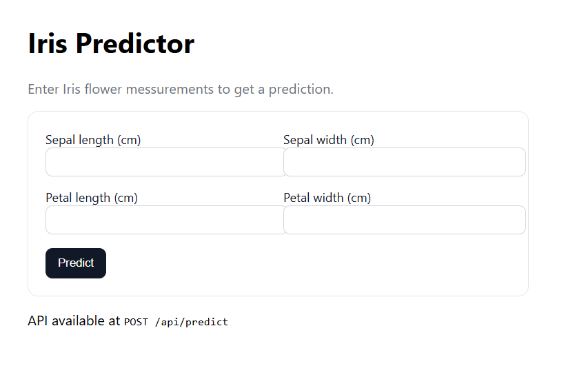

# Django Machine Learning App

A simple machine learning application using scikit-learn for Iris dataset prediction built with Django. Based on the KDnuggets tutorial [*“Building Machine Learning Application with Django”*](https://www.kdnuggets.com/building-machine-learning-application-with-django). 

---


## Specification

- Dataset: Iris dataset
- Model: RandomForest  
- JSON API endpoint   
- Simple tests to check that homepage and API are working  

---

## Project Structure
```
├───img
├───mlapp
│   └───__pycache__
├───predictor
│   ├───migrations
│   │   └───__pycache__
│   ├───model
│   └───__pycache__
├───static
│   └───css
└───templates
    └───predictor
```

## How To Install
Clone this repo:
```
git clone https://github.com/rangga-prangwedana/django-iris-app.git
```

Install the requirements. Make sure you already have Python 3 installed. The main libraries are Django, joblib, and scikit-learn.
```
pip install Django joblib scikit-learn
```

## How To Run



Go to the repository.
```
cd django-iris-app
```

(OPTIONAL) If you want to try running the model train script:
```
python train.py
```

Running the tests:
```
pythoh manage.py test
```


Running the webserver:
```
python manage.py migrate
python manage.py runserver
```

then click the generated link (http://127.0.0.1:8000/). Quit with CTRL + C.


